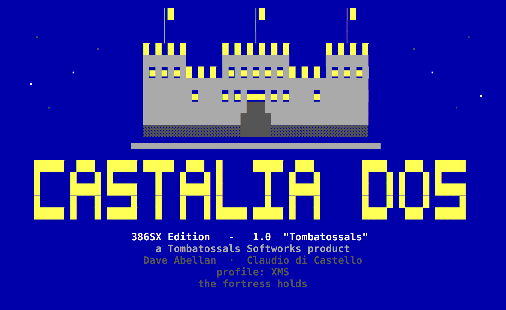
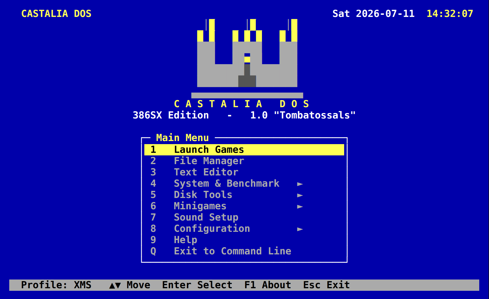
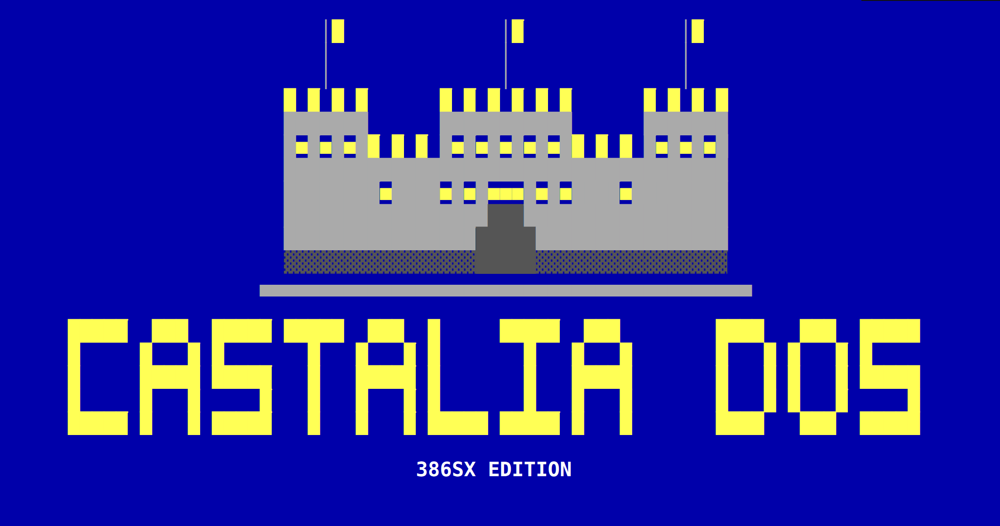
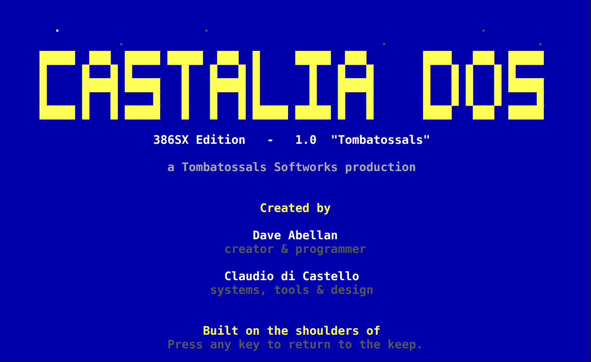

# CASTALIA DOS — Press Kit

> **A serious, game-focused DOS for real 386 hardware — a Mediterranean
> fortress for your 386.**

This folder is a self-contained media kit for journalists, editors, and
bloggers (PC Magazine–style press, retro-computing sites, and geek/IT blogs).
Everything here is free to use to cover CASTALIA DOS. Text is CC BY 4.0; the
logos and screenshots may be reproduced in coverage of the project — see
[`CREDITS-AND-LICENSING.md`](CREDITS-AND-LICENSING.md).

---

## The one-liner

**CASTALIA DOS** is a practical, beautiful, game-focused DOS-compatible
operating environment for real 386SX / 386DX / 486 / early-Pentium machines.
It is built on the open-source **FreeDOS** kernel and shell and wraps them in
an original suite of tools, boot profiles, a game launcher, an installer, and a
dignified 80×25 text-mode identity — so the machine boots onto **Castalia and
nothing else**.

- **Edition:** CASTALIA DOS 386SX Edition · design target **1.0 "Tombatossals"**
- **Foundation:** FreeDOS (GPLv2+) + Open Watcom build + original Castalia tools (MIT)
- **Status:** in active development, open source
- **Repository:** https://github.com/davabe/Castalia-DOS

---

## What's in this kit

| File | What it is |
|---|---|
| [`PRESS-RELEASE.md`](PRESS-RELEASE.md) | The announcement, ready to quote. |
| [`FACT-SHEET.md`](FACT-SHEET.md) | Quick facts: platform, licence, requirements. |
| [`ABOUT.md`](ABOUT.md) | Boilerplate descriptions (25 / 50 / 150 words). |
| [`FEATURES.md`](FEATURES.md) | The feature list, in plain language. |
| [`TECHNICAL.md`](TECHNICAL.md) | Architecture, what we used, how it's built. |
| [`STORY.md`](STORY.md) | The "why" — philosophy and design story, with quotes. |
| [`ROADMAP.md`](ROADMAP.md) | Where it's going, and what we want to achieve. |
| [`CREDITS-AND-LICENSING.md`](CREDITS-AND-LICENSING.md) | Attribution, licences, asset usage terms. |
| `images/screenshots/` | Seven PNG screenshots of the real boot experience. |
| `images/logos/` | Logo lockups (PNG + scalable SVG, colour + mono). |
| `images/misc/` | The VGA 16-colour palette reference. |

---

## The look, at a glance

The boot banner — the fortress keep rises, the wordmark lights amber, stars
twinkle over the Mediterranean night:

The Castalia menu — the screen you live in, crowned with the same keep:

The primary logo lockup:

The credits roll — a demoscene-style scroll that names the makers, reachable
from the About screen or by running `CASTALIA /CREDITS`:

More screens: the rescue/install disk, the installer welcome, the celebratory
"INSTALLED" screen, and the About panel are all in
[`images/screenshots/`](images/screenshots/).

---

## Fast facts

- **Name (always):** CASTALIA DOS (all-caps in banners; "Castalia DOS" in prose).
- **Category:** DOS-compatible operating environment / retro-computing.
- **Price:** free and open source.
- **Platforms:** real 386-class hardware, CompactFlash/IDE, floppy — and it runs
  beautifully in DOSBox-X and 86Box.
- **Licence:** original Castalia code & branding **MIT**; FreeDOS components
  **GPLv2+** (source shipped in `third_party/`).
- **Not:** an MS-DOS clone. It ships no Microsoft code, text, or branding.

---

## Contact

- **Studio:** Tombatossals Softworks
- **Press enquiries:** hello@tombatossalssoftworks.com
- **Project & source:** https://github.com/davabe/Castalia-DOS
- **News / issues / questions:** open an issue or discussion on the repository.

*CASTALIA DOS is a project of Tombatossals Softworks. © 2026. This kit may be
updated; the newest version lives in `presskit/` in the repository.*
